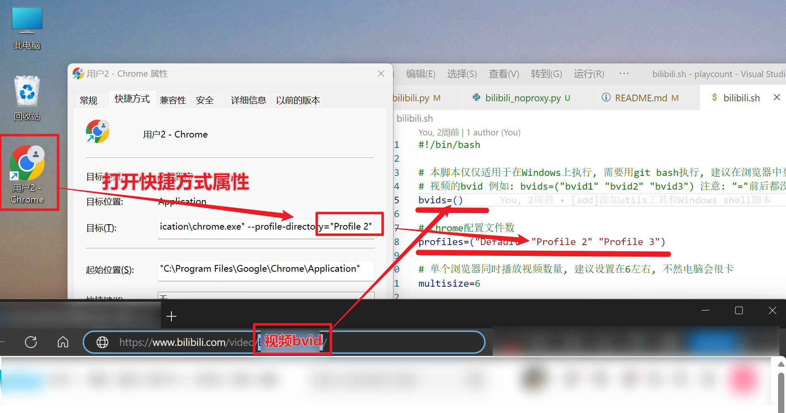
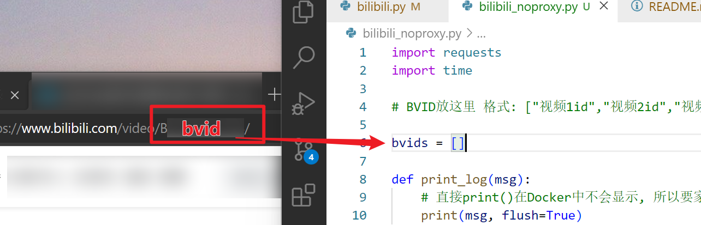
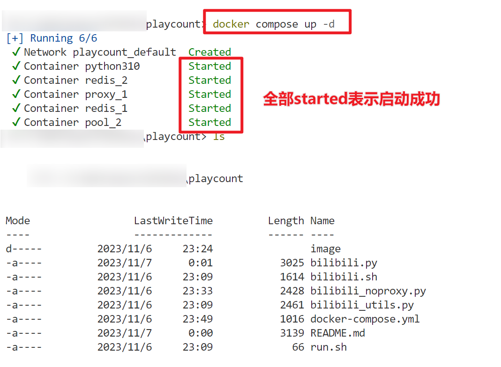
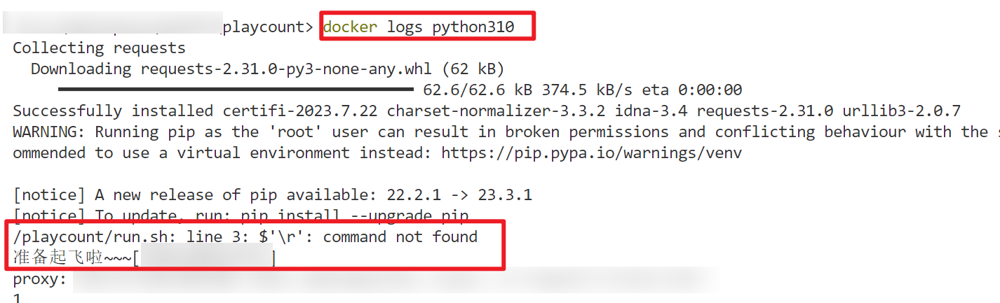

# PlayCount

## Desc

为bilibili而来, 用来刷B站播放量, 懂的都懂

## 使用方式 - 推荐使用第1种方式

### shell脚本 + 浏览器方式:

仅Windows可用, 编辑 [bilibili.sh](./bilibili.sh) 脚本, 修改 **bvid** 和 **profiles** 两个参数, 然后直接执行该脚本即可, 需要注意的是, 最好安装git客户端, 用 git-bash 来跑, 有时候 powershell可能跑失败
Tips: 如果是多个浏览器, 建议每个浏览器登录不同的账号, 这样效率会高一点
**优点**: 可以一直刷
**缺点**: 耗时比较长, 每个浏览器大概每6分钟刷一次播放



### 使用 **python** 运行 且 **不使用代理池** :

修改 [bilibili_noproxy.py](./bilibili_noproxy.py) 文件, 将bvid填写到bvids里面, 然后在终端执行下面命令即可

```powershell
python bilibili_noproxy.py
```

**优点**: 简单, 不依赖浏览器, 只需要调用接口就能刷播放量
**缺点**: 耗时比较长, 大概每6分钟刷一次播放, 而且不能一直刷, 刷到一定播放量之后就不能再刷了



### 使用 **docker** + **代理池** :

**目前该方案我在实际使用的过程中效果跟第2种方法是一样的, 代理池使用了还是不管用, emmm, 所以你自己慢慢研究吧**
**优点**: docker执行, 可以使用代理池, 不依赖浏览器, 只需要调用接口就能刷播放量
**缺点**: 耗时比较长, 刷一次之后, 要过一段时间才能刷下一次播放, 而且不能一直刷, 刷到一定播放量之后就不能再刷了

1. 安装docker, 下载地址: [docker](https://www.docker.com/products/docker-desktop/) , 安装, 安装完成之后, 启动docker
2. 修改脚本, 修改 [bilibili.py](./bilibili.py) , 将bvid填写到bvids里面
   
3. **开始执行脚本**
   在该目录下, 在终端中执行以下命令, Container 全部状态 started表示启动成功

```powershell
docker compose up -d
```



4. 查看日志, 执行以下命令, 看到日志有输出"准备起飞啦~~~"且后面中括号中有你要刷播放量的视频bvid, 表示脚本执行成功了

```
docker logs python310
```



5. **停止刷**
   继续在该目录下, 在终端中执行以下命令

```
docker compose down
```

综上所述, 推荐使用 **第1种** 种方法刷

### 修改脚本

修改 [bilibili.py](./bilibili.py) 脚本, 将视频的id号放入到bvids数组中

例如:

```python
bvids = ["bvid1", "bvid2", "bvid3"]
```

bvid获取:

复制视频播放地址 **/video/** 后面就是bvid

```
https://www.bilibili.com/video/bvid在这里/?spm_id_from=333.999.0.0
```

### Docker方式

直接执行即可

```shell
docker compose up -d
```

### 本地跑

本地跑可以选择使用代理或者不适用代理

**使用代理**: 下面的代理池至少启动一个, 并配置好 **bilibili.py** 的 **proxypool** 内容

**不使用代理**: 修改bilibili.py中的所有 **request** 的数据, 把 **proxies** 部分删掉

配置好后执行以下命令

```shell
pip install requests

python bilibili.python
```

## 代理池

```python
proxypool={"url":"http://192.168.1.4:5555/random","type":"1"}

proxypool={"url":"http://192.168.1.4:5010/get","type":"2"}
```

Proxy 1 来自: [Python3WebSpider/ProxyPool](https://github.com/Python3WebSpider/ProxyPool)

Proxy 2 来自: [jhao104/proxy_pool](https://github.com/jhao104/proxy_pool)

## 已知问题

1. 每次请求后要sleep(100)才能继续, 即使使用了代理也不能随便浪
2. 并不是所有的视频都能刷播放量
3. **慎用**, **慎用**, **慎用**
